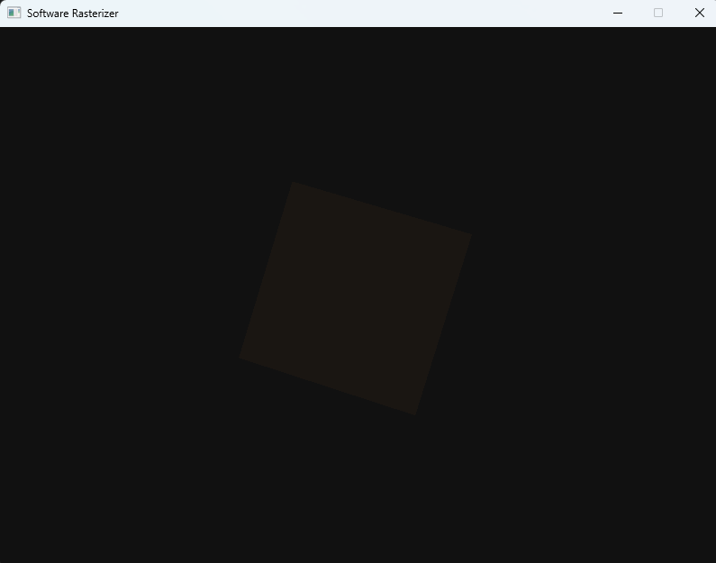

# Software Rasterizer

A real-time 3D renderer written in C++17 that runs entirely on the CPU — no OpenGL, no Vulkan, no GPU APIs of any kind. Everything from triangle fill to lighting is computed by hand.



---

## Features

- **Triangle rasterization** using barycentric coordinates
- **Z-buffer** (depth buffer) for correct occlusion
- **Phong shading** — ambient, diffuse, and specular with a directional light
- **Perspective-correct interpolation** of vertex normals across triangles
- **OBJ mesh loader** — supports `v`, `vn`, `f` tokens; triangulates quads automatically
- **Auto-normalizes** any mesh to fit on screen regardless of original scale
- Renders a spinning model in real-time via an SDL2 window

---

## Build

### Requirements
- CMake 3.15+
- A C++17 compiler (MSVC, GCC, or Clang)
- SDL2

### Windows (vcpkg)

```bat
vcpkg install sdl2:x64-windows
cmake -B build -DCMAKE_TOOLCHAIN_FILE=C:/vcpkg/scripts/buildsystems/vcpkg.cmake
cmake --build build --config Release
```

### Linux / macOS

```sh
# Ubuntu/Debian
sudo apt install libsdl2-dev

cmake -B build
cmake --build build
./build/rasterizer model.obj
```

---

## Usage

```
rasterizer [model.obj]
```

- Pass any `.obj` file as the first argument. The mesh is auto-centered and scaled to fit.
- If no file is given the program renders a built-in cube so you can verify the build immediately.
- Press **Escape** or close the window to quit.

---

## How it works

### Pipeline (per frame)

```
OBJ vertices  →  MVP transform  →  perspective divide (NDC)
     →  viewport transform (pixels)  →  rasterize triangles
     →  depth test (z-buffer)  →  Phong shade  →  SDL2 blit
```

### Rasterization

For each triangle the code finds the axis-aligned bounding box in screen space, then iterates every pixel inside it. Barycentric weights `(w0, w1, w2)` are computed for the pixel center. If all three are non-negative the pixel is inside the triangle and proceeds to shading.

### Depth testing

Each pixel stores the NDC `z` value in a parallel float buffer initialized to `1.0` (far plane). A new fragment only overwrites the buffer if its `z` is smaller than what is already there.

### Phong shading

Normals are interpolated across the triangle using perspective-correct barycentric weighting (`attribute / w`, then divided by `1/w`). At each pixel:

```
color = albedo * (ambient + kd * max(0, N·L))
      + specular * ks * max(0, R·V)^shininess
```

where `L` is the normalized light direction, `N` the interpolated surface normal, `R = reflect(-L, N)`, and `V` the view direction.

---

## Project layout

```
src/
  math.h        — Vec3, Vec4, Mat4 (perspective, lookAt, rotations)
  mesh.h/.cpp   — OBJ loader and flat-normal fallback
  renderer.h/.cpp — framebuffer, z-buffer, triangle fill and shading
  main.cpp      — SDL2 window, render loop, MVP transforms
CMakeLists.txt
```

---

## Author

**ParshCodes**
